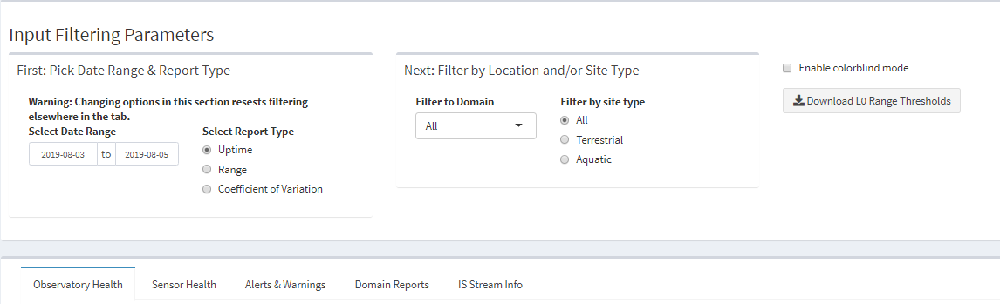
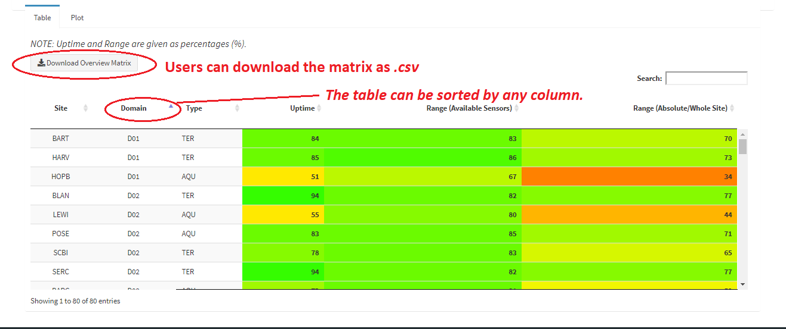
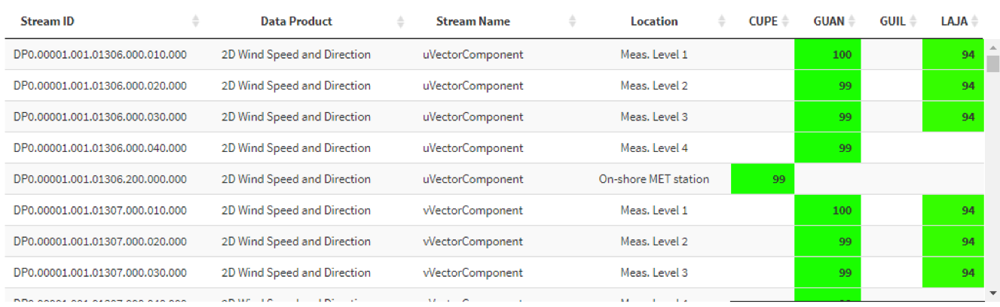

## App Overview
Welcome to the _Sensor Health Tracker_.  This portion of the Shiny App tracks over **20,000** unique Instrumented Systems (IS) Level 0 (L0) data streams throughout the Observatory.  _The Sensor Health Tracker_ **passively** monitors sensor activity allowing for:

* an efficient and optimized approach to identifying sensor-related issues
* quantification of sensor uptime, readings within range, and stuck and/or overly noisy sensors
* production of tables, plots, and human readable, descriptive reports
* an indefinite history of sensor health (SAS reports only provide a 45 day history)

## Using the Tracker
The tracker has a filtering section and 5 main tabs.  The filtering options are positioned at the top of the Tracker and are applicable to the Observatory Health, Alerts & Warnings, and Stream Health tabs (Figure 1).

  

_Figure 1. Filtering options are located at the top of the Sensor Health Tracker.  The main tabs are located below the filtering options._

### Tab Overview
There are 5 main tabs within this app.  

* The **_Observatory Health_** tab gives a high-level summary of the Observatory's health and each site’s health in the form of % uptime and the validity of the reporting ranges of the sensors at a site.  
* The **_Sensor Health_** tab is a more granular version of the _Observatory Health_ tab.  It allows users to investigate uptime, measurement ranges, and coefficient of variation metrics for individual streams across a single or multiple sites.  
* The **_Alerts & Warnings_** tab applies logic to the information in the _Sensor Health_ tab to produce summaries (alerts and warnings) for each stream at a given site.  More details on this can be found in the Tab Descriptions, below.  
* The **_Domain Reports_** tab allows users to sign up for an email-based report that provides human readable details about sensor-specific alerts and warnings at each domain.  More information on this can be found below.
* The **_IS Stream Info_** tab provides background information about the data streams that are or are not monitored via this app.  

## Tab Descriptions

### Observatory Health
-	High-level overviews of the Observatory's sensor-related ‘health’.  This includes overall data completeness and in-range values of all applicable IS data streams monitored by the app. Within this section you can also find tables and plots comprising site-level information about:
    - Uptime – percent of data successfully streamed from the sensor
    - Range - percent of sensor data within calibration or operating range.  These Level 0, stream-specific ranges are provided by NEON’s CVAL and can be accessed and downloaded from the main screen of the app within the filtering area. Two different range metrics are provided:
        - Available Sensors – percent of sensor data within range, independent of sensor uptime. _Note: The plotting function within Observatory Health plots Range metrics for Available Sensors_
        - Absolute/Whole Site – percent of sensor data within range, provided as a function of sensor uptime. Mathematically this is defined as:

<i>Rab</i>=<i>Rav</i> * <i>U</i> 

        Where:

        <i>Rab</i> = Range (Absolute/Whole Site)  
        <i>Rav</i> = Range (Available Sensors)  
        <i>U</i>  = Uptime  

  

_Figure 2. Tabular example of Observatory Health for Jul 10 – Jul 15.  Uptime and Range metrics are provided as percentages (%)._

_Figure 3. Plot example of % uptime for D01 (Mar 31 2019 - Jun 01 2019)_

### Sensor Health
A more granular version of the _Observatory Health_ tab, the _Sensor Health_ tab provides tables and plots that inform the health of each IS sensor at a site.  Uptime, Range, and coefficient of variation information are provided in this tab.  Like the _Observatory Health_ tab, tables and plots shown here can also be downloaded.

  

_Figure 4.  Tabular example of Sensor Uptime for Jul 14 – Jul 16 at D04._

  

_Figure 5.  Coefficient of Variation plot for D01-BART Triple Aspirated Air Temperature assembly’s PRT resistance stream (Jul 4 thru Jul 16 2019)._

### Alerts & Warnings
#### Alerts
Alerts are:
 - Are provided as absolute percentages relative to a given site-assembly pair
 - Are applied on a stream by stream basis
 - Identify problematic sensor streams

 There are three types of Alerts: 
 
 1. UPTIME: triggered when a stream is reporting **< 80% or > 110%** of expected measurements for a given time period
 2. RANGE: triggered when **< 80%** of a stream's measurements are within expected operational range for a given time period
 3. COEFFICIENT of VARIATION (CV): triggered when the CV of a stream **equals 0** for a given time period.  The CV test identifies streams that may be "stuck."
    -	While a majority of sensor streams are tested for CV = 0, a handful of sensor streams _are not_ tested to mitigate reporting of false positives.  For instance, soil water content and soil temperature data products are not included in our CV alert tests because their values typically don’t fluctuate much in a 24-hour period, especially at deeper soil depths.
    -	CV is calculated by dividing the population’s standard deviation by the population's mean.

#### Examples
The following examples are provided for Single Aspirated Air Temperature (SAAT) assemblies at DSNY

DSNY has 3 Single Aspirated Air Temperature (SAAT) assemblies. Each SAAT assembly has 3 data streams:

1. PRT resistance
2. fan speed
3. turbine speed  

There are 9 total SAAT streams at DSNY (3 SAAT assemblies * 3 data streams).  All SAAT streams have a nominal reporting rate of 1 Hz, i.e., data are reported once a second.  

#### Example 1: Uptime Alert

There should be 86,400 measurements per day per 1 Hz data stream reported by each SAAT assembly. If any SAAT stream returns less than 69,120 measurements, i.e., 80%, in a given day, an alert will be generated _for that stream_. Let's assume that 2 of the 9 SAAT streams at DSNY are reporting at less than 80% uptime.  In this case, the Uptime Alerts tab will show '22' (i.e., 22%) for SAAT assemblies at DSNY.  Put simply, this can be interpreted as: "22% of all SAAT streams at DSNY are reporting less than 80% data availability."

_Figure 6.  Uptime example for the SAAT assembly at DSNY.  22% of all SAAT streams at DSNY fell below the 80% uptime threshold for the given day_

#### Example 2: Range Alert
NEON's Calibration Validation and Audit Laboratory (CVAL) provided calibration and/or manufacturer suggested thresholds for many L0 data streams. Each L0 stream of the SAAT assembly have assigned operational ranges (see  table below).

| Stream (units) |	 Min |	Max |
|---|---|---|
| PRT resistance (Ohms) |	   87 | 120 |
| Fan Speed (RPM) |	900	|    20000 |
| Turbine Speed (RPM) |	   300	| 20000 |

Assume the following:
-	Turbine Speeds at  ML2 and ML3 are 0 rpms all day (i.e., 0% within range)
-	PRT Resistance on ML3 is reporting between 118 and 120 ohms for 76% of the day and > 120 for 24% of the day

In each case, the 3 streams are within their respective operational range for less than 80% of the day.  As such, range alerts for 3 of the 9 SAAT streams (33%) at DSNY will be generated.

#### Example 3: CV Alert
The two turbines that are reporting 0 rpms all day, will also be flagged by the CV tests.  Because the magnitudes of these measurements do not fluctuate throughout the day, their CV values are subsequently equal to 0.  As such, both the turbine streams (ML 2 and ML 3) will be flagged by the CV test and alerts will be generated.

### Warnings
Warnings are:

-	Are provided as absolute percentages relative to a given site-assembly pair
- Are applied on a stream by stream basis
- Give a ‘heads up’ for streams that may become problematic in the near future

There are three types of warnings:

1. UPTIME: triggered when a stream is reporting **≥ 80% and < 90%** of expected measurements for a given time period
2. RANGE: triggered when **≥ 80% and < 90%** of a stream's measurements are within expected operational range for a given time period
3. COEFFICIENT of VARIATION (CV): triggered when the CV of a stream is **> 20** for a given time period.  This CV test identifies streams that are overly noisy.  
    - We’ve implemented back-end logic in this app to ensure that CV tests are only applied to applicable streams. For instance, 2D wind speed and direction streams having CV > 20 _do not raise a warning_ because wind is a naturally chaotic phenomenon.

#### Examples
Please see the examples for Alerts. Warnings follow the same logic as Alerts but are functions of different thresholds.

### Domain Reports
Domain Reports are:
- Human readable reports
- Descriptive summaries of Alerts for each site listed by Domain.  **Note: not all alerts will prompt generation of a human readable issue in the _Domain Reports_.** A great deal of logic is built into the _Domain Reports_ to mitigate false positives. 
- Broken down by sensor type and location
- Can be used to generate on-the-fly Service Now tickets
- Emailed to interested parties on frequency of their choosing.  **Enroll now!**

#### Example
Example report output to August 4th, 2019, for Domain 1:

---
## D01

	HARV:
	 Single aspirated air temperature:
		- Turbine broken or assembly inlet blocked at meas. level 1
	 Phenocams:
		- Assembly failure at meas. level 2
		- Assembly failure at meas. level 6

	BART:
	 Single aspirated air temperature:
		- Turbine broken or assembly inlet blocked at meas. level 1
		- Assembly failure at meas. level 2
	 Phenocams:
		- Assembly failure at meas. level 2
		- Assembly failure at meas. level 6
	 Photosynthetically Active Radiation:
		- Stream failure (inPAR) at meas. level 2
	 2D Wind Speed and Direction:
		- Assembly failure at meas. level 2

	HOPB:
		No alerts

---

Domain Reports can be delivered by domain or for the whole observatory.

**IMPORTANT:** These domain reports are in a very early stage, and should not be treated as the final word of the condition of sensors. Not all issues a sensor/stream can experience are captured in the reports, and false-positives for sensor failure may be reported here. For now Domain Reports are meant to compliment other diagnostic checks and highlight issues that may be happening.

Domain Reports will be refined over the coming months, so expect to see changes to the formatting/content often. If you have suggestions or find an issue, please report them here!

### IS Stream Info
The _IS Stream Info_ tab lists Data Products monitored and not monitored by the _Sensor Health Tracker_. Level 0 (L0) data product IDs are also listed for the data products in each category.

__Note:__ Not all streams within an L0 data product are monitored. Intermittent streams (e.g. Wet deposition collector lid status) do not have a regular streaming rate, and are not monitored here.

## Putting it All Together:
The Sensor Health Tracker can be used in many ways.  Users can search for Observatory stats, site- and/or sensor-specfic information, alerts/warnings, etc. While all of this information is great, we realize it can also be overwhelming.  For an efficient way to identify and investigate up-to-date sensor-related issues, we highly recommend signing up for the _Domain Reports_ and choosing to receive these reports on a daily basis.  Each morning, the previous day's _Domain Report_ will be emailed to all interested parties. The most recent report will also be posted to the App during that time.  As the *Domain Reports* become robust the information within them will take much of the guess work out of identifying sensor-related issues.  For instance, if all 3 streams of a SAAT assembly at ML2 are showing 0% uptime, the domain report may say something along the lines of **Assembly failure at meas. level 2**, instead of noting that each individual stream is down. Users can then use the other features of the Sensor Health App, e.g., _Sensor Health_, to better understand the sensor-related issues within the _Domain Reports_.  The information in these reports can even be used to generate on-the-fly ServiceNow tickets.

